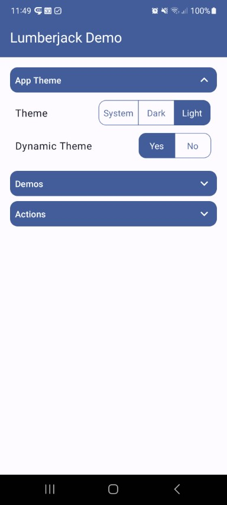

### About

A simple base activity in compose used in all my compose libraries inside the demo modules with some common used UI composables.

Provides following:

* a base activity that supports dark/light/system theme
* a toast helper
* ui elements for
  * app theme settings
  * expandable regions
  * segmented button
  * a compose list saver that also saves an empty list

### Dependencies

| Dependency |      Version | Infos |
|:-|-------------:|:-:|
| [Compose BOM](https://developer.android.com/jetpack/compose/bom/bom) | `2024.02.01` | [Mapping](https://developer.android.com/jetpack/compose/bom/bom-mapping) |
| Material3 |      `1.2.0` | |

### Screenshot

